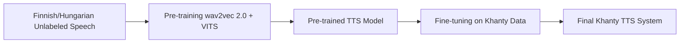

## Description

The pipeline begins with unlabeled speech data from Finnish/Hungarian. This data is used in the pre-training phase, where wav2vec 2.0 and VITS work together to learn useful speech representations. The result is a pre-trained Text-to-Speech model. Next, this model undergoes fine-tuning using the limited labeled data available for Khanty. Finally, the process produces a fully adapted TTS system capable of synthesising speech in Khanty with high quality despite scarce resources.

## Phase I: Data Preparation
1. **Audio Preprocessing**  
   Convert all Finnish and Khanty (80 min) audio to unified format (WAV 16 kHz, mono).

## Phase II: Pseudo-Phoneme Dictionary
2. **W2V2 Feature Extraction**  
   Extract hidden states from Wav2Vec 2.0 (Layer 15) across the entire unlabelled Finnish audio corpus.

3. **K-Means Training**  
   Cluster W2V2 features to create dictionary of K=128 centroids (pseudo-phonemes). 

4. **Pseudo-Phoneme Labelling**  
   Assign nearest centroid ID to each frame of Finnish audio. Create VITS metadata file.

## Phase III: VITS Training
5. **VITS Pre-training**  
   Train VITS model on Finnish audio + pseudo-phonemes. Model learns to map pseudo-phoneme sequences to acoustic signals.

6. **VITS Fine-tuning**  
   Fine-tune pre-trained VITS on labelled Khanty audio (audio + text). Model switches from pseudo-phonemes to real text.

## Team Members

Our group is the same, from the Khanty project (3 people):

- Lena
- Anna
- Alina A.

