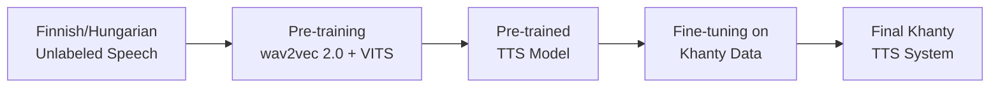

## Description

The pipeline begins with unlabeled speech data from Finnish/Hungarian. This data is used in the pre-training phase, where wav2vec 2.0 and VITS work together to learn useful speech representations. The result is a pre-trained Text-to-Speech model. Next, this model undergoes fine-tuning using the limited labeled data available for Khanty. Finally, the process produces a fully adapted TTS system capable of synthesising speech in Khanty with high quality despite scarce resources.

## Team Members

Our group is the same, from the Khanty project (3 people):

- Lena
- Anna
- Alina A.

